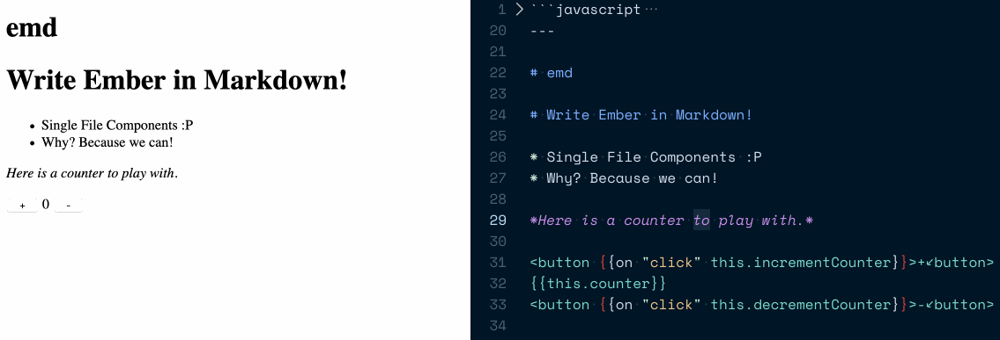

ember-md(emd)
==============================================================================

This addon lets you write your EmberJS code in Markdown. This is useful
for cases like blogs where Markdown feels more natural than HBS. It also
lets you write your JS and template code in the same file. Single File Components 😝

**[You can try an interactive demo here](https://astronomersiva.github.io/ember-md/)**



Compatibility
------------------------------------------------------------------------------

* Ember.js v3.4 or above
* Ember CLI v3.12 or above
* Node.js v8 or above


Installation
------------------------------------------------------------------------------

```
ember install ember-md
```


Usage
------------------------------------------------------------------------------

Write your components(templates and class files) as a single `emd` file.
For example, in `app/components`, you can have the file `greeting.emd` and you
can just use the component in `application.hbs` just like you would in normal applications.

You can use both Glimmer and Ember components.

```md
  <!-- greet.emd -->
  ```javascript
    import Component from '@glimmer/component';
    import { tracked } from '@glimmer/tracking';
    import { action } from '@ember/object';

    export default class GreetComponent extends Component {
      @tracked name = 'Emberista';

      @action
      sayName() {
        window.alert(`Hello, ${this.name}!`);
      }
    }
  `` `

  ---

  ## let me greet you

  <label>Hey! What's your name?
    {{input value=name}}
  </label>

  <button {{on "click" this.sayName}}>Click Me!</button>
```

Remember to add the Horizontal Rule(`---`) between the JavaScript code and the emplate.

If your editor does not automatically apply Markdown formatting to the `.emd` files, you
can add custom File Associations. I have tested this both in VSCode and Atom.

Known Caveats
------------------------------------------------------------------------------

* Rebuilds(and live reload) will be triggered for the templates but not for
  the the component class. I am looking into ways of making this possible.


License
------------------------------------------------------------------------------

This project is licensed under the [MIT License](LICENSE.md).
